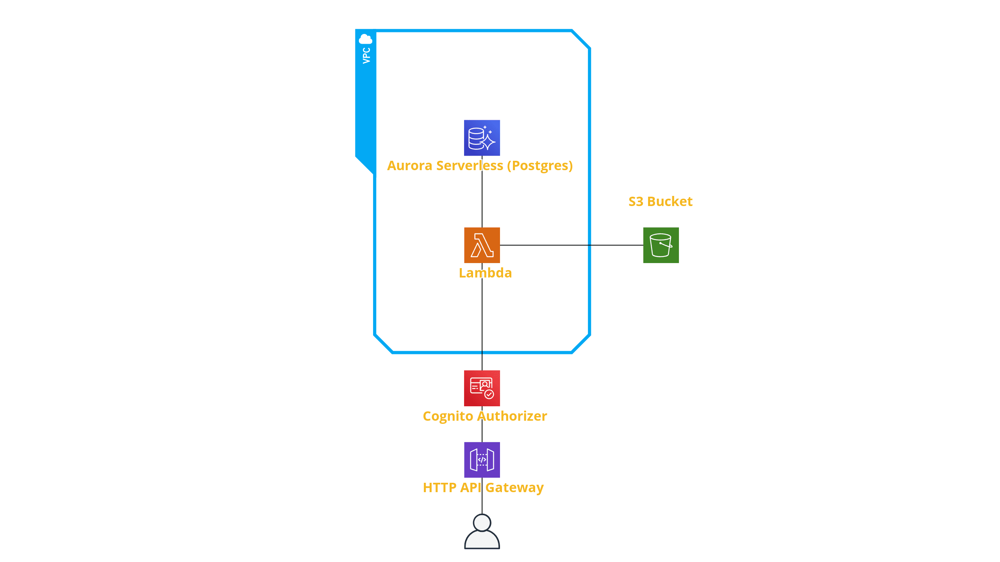
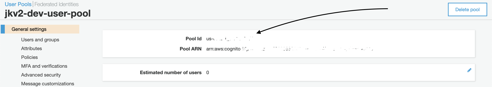
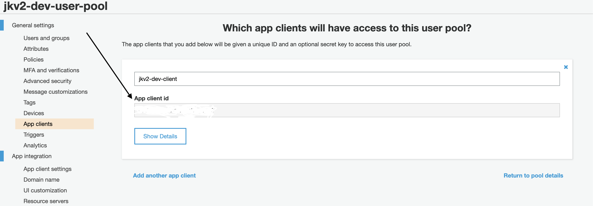
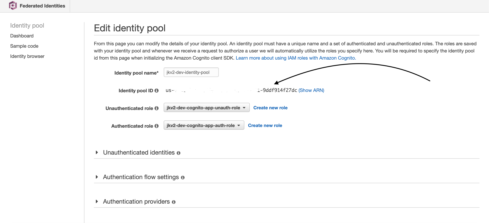

# JKv2 Yeoman generator
Opinionated generator for mono-repo web apps.

Features:
- Monorepo with npm7 workspaces (backend, core, frontend)
- No framework. Plain Typescript functions and API Gateway routing to Lambdas running in VPC
- TypeORM & Postgres
- Cognito

## Quickstart

### Pre-requisites
* npm 7
* yeoman
* jkv2 generator

```shell
npm i -g npm@7 yo generator-jkv2
yo jkv2
```

### Useful commands
- `yo jkv2:model`  # Create a new TypeORM model and CRUD for it

- `yo jkv2:api`  # Create a new API endpoint for a model

- `npm run db:init:local`  # Re-creates local DB, migrates and seeds it

- `npm run db:migrate:generate -n $name`  # Create a new migrations

- `npm run sls:deploy:dev`  # Deploy to the dev environment


### AWS services schema


### VPC/Aurora Data API
Currently VPC connection is recommended.

It offers DB driver that doesn’t have problems with types unlike the one used by Aurora Data API. However using it is a bit more pricy and there are problems with Lambda timeouts after hitting 10 requests per second on a Lambda.
Once the Data API is somewhat more mature we should consider switching to it.

### API validation/serialization
[lambda-middleware](https://dbartholomae.github.io/lambda-middleware/) and [class-validator](https://github.com/typestack/class-validator) packages are used for incoming request body validation.

Currently when serializing responses there’s no option to exclude unwanted fields.

### Setting up Cognito
In your `.env.local` or in your env variables config on e.g. Netlify you'll have to assign the following env variables:
```shell
REACT_APP_COGNITO_IDENTITY_POOL_ID,
REACT_APP_COGNITO_REGION,
REACT_APP_COGNITO_IDENTITY_POOL_REGION,
REACT_APP_COGNITO_USER_POOL_ID,
REACT_APP_COGNITO_USER_POOL_APP_CLIENT_ID,
REACT_APP_API_REGION
```
To find some of the values you should login to your aws account

`REACT_APP_COGNITO_USER_POOL_ID`


`REACT_APP_COGNITO_USER_POOL_APP_CLIENT_ID`


`REACT_APP_IDENTITY_POOL_ID`

